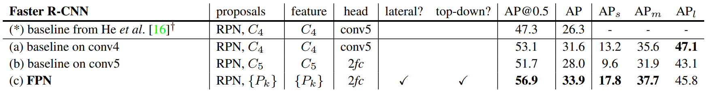

# Feature Pyramid Networks for Object Detection Reimplementation
Reimplemented by Jack Jansons (jcj59), Rob Mosher (ram487), Raphael Thesmar (rft38)
## Introduction

 - **Title**: [Feature Pyramid Networks for Object Detection](https://arxiv.org/pdf/1612.03144)
 - **Authors**: Tsung-Yi Lin, Piotr Dollár, Ross Girshick, Kaiming He, Bharath Hariharan, Serge Belongie
 - **Venue**: 2017 IEEE Conference on Computer Vision and Pattern Recognition (CVPR 2017)


Our project consisted of a re-implementation of the influential paper titled "Feature Pyramid Networks for Object Detection," by Tsung-Yi Lin, Piotr Dollár, Ross Girshick, Kaiming He, Bharath Hariharan, and Serge Belongie, presented at the 2017 IEEE Conference on Computer Vision and Pattern Recognition (CVPR 2017). The paper introduced a new approach for object detection, leveraging a pyramid of features with varying resolutions at each level to enhance object detection performance across a variety of object scales. By constructing and systematically connecting high-level semantic feature maps at all scales, the proposed architecture demonstrated significant improvement in the speed and accuracy of detecting objects compared to prior methods. Our project aimed to replicate these findings, allowing us to learn more about the architecture's mechanics in the process.
		
### Architecture Outline

The architecture takes a single-scale image of arbitrary size as input, and outputs proportionally sized feature maps at multiple levels, in a fully convolutional fashion. 

The bottom-up pathway is the feedforward computation of the backbone ConvNet, which computes a feature hierarchy consisting of feature maps at several scales with a scaling step of 2. There are often many layers producing output maps of the same size and we say these layers are in the same network stage. We choose the output of the last layer of each stage as our reference set of feature maps. The paper uses both pretrained ResNet50 and ResNet101 for this bottom-up pathway, typically consisting of five network stages.

The top-down pathway hallucinates higher resolution features by upsampling spatially coarser, but semantically stronger, feature maps from higher pyramid levels. These features are then enhanced with features from the bottom-up pathway via lateral connections. Each lateral connection merges feature maps of the same spatial size from the bottom-up pathway and the top-down pathway. The bottom-up feature map is of lower-level semantics, but its activations are more accurately localized as it was subsampled fewer times.

The feature map outputs are fed into Facebook AI Research’s (FAIR) Detectron2 RPN and Faster R-CNN implementations for object recognition and classification.

### Paper Contributions

The main contribution of this paper was a new approach to creating inputs for the Faster R-CNN object detection algorithm by generating a feature pyramid that has rich semantics at all levels and can be built quickly from a single input image. This new feature pyramid is one that can outperform older featurized image pyramid approaches without sacrificing representational power, speed, or memory performance.

This was achieved by leveraging the naturally pyramidal shape of a ConvNet’s feature hierarchy while creating a feature pyramid that has strong semantics at all scales. To achieve this goal, an architecture is developed that combines low-resolution, semantically strong features with high-resolution, semantically weak features via bottom-up and top-down pathways linked by lateral connections. 

## Chosen Result
We attempted  to replicate Table 3 from the paper, which includes object detection results using Faster R-CNN evaluated on the COCO minival set. The table demonstrates that backbone networks for RPN are consistent with Faster R-CNN. Specifically, this means meeting the paper’s standards for the AP@0.5 metric, which refers to the average precision ratio of true positives to the sum of true and false positives at an IoU (Intersection over Union) threshold of 0.5. For reference, an IoU threshold of 0.5 means that a prediction is considered correct if the predicted bounding box and the ground truth box have an overlap of 50% or more. A higher AP@0.5 score implies that the model is better at predicting bounding boxes that overlap the ground truth by at least 50%. This is a commonly used evaluation technique for rating the performance of object detection models.

The paper demonstrates that using an FPN to create feature maps for use with a Faster R-CNN head provides an improvement in AP at the 0.5 IoU threshold over previous SOTA models, such as the Deep Residual Learning for Image Recognition model created by He et al., which won the ImageNet Large Scale Visual Recognition Challenge in 2015.



## Re-implementation Details
In our attempt at replicating the paper’s results, we tried 5 slightly different model architectures which each combat a different problem we faced along the way. Each architecture uses either a different bottom up backbone, pretrained model weights, or layers.

### Custom Bottom Up Backbone
The paper described using residual networks, so our first replication attempt consisted of using a custom-built bottom-up pathway using 6 “bottom-up blocks." Within each block, The first layer, a scaling step, was handled by performing a 3x3 convolution with a padding of one and a stride of 2. The output of this layer was then saved and passed through a 1x1 convolution to be added to the output of the last layer as a residual connection. The second and third layers consisted of subsequent 3x3 convolutions with a padding and stride of 1. In between each convolutional layer, a ReLU nonlinearity layer and a BatchNorm operation were applied in order to stabilize training. The output of the third layer was then added to the residual connection, and sent to the next block. The outputs of the 2nd through 6th blocks were passed through a 1x1x256 convolution to increase dimensionality, and used as lateral connections for use in the Top-Down pathway. The lateral connection from the last layer of the Bottom-Up pathway was used to begin the top-down pathway, and at each level, a 2x upscaling operation on the previous layer was performed using nearest neighbor interpolation followed by an element-wise addition of the lateral connection from the corresponding bottom-up layer, dimensionality wise. Each level of the Top-Down layer was then passed through a 3x3 convolution and output as a feature map. Lastly, these feature maps were input into FAIR’s Detectron2 implementation of an untrained RPN and Faster R-CNN. Unfortunately, after 36 hours of training, poor performance remained, with an AP@0.5 of 0 that was failing to improve, and the decision was made to attempt a different bottom up backbone implementation.

### ResNet50 Backbone
For our next attempt, we tried to use the backbone outlined in the paper, namely pretrained ResNet50. We maintained the rest of the model architecture, only replacing the custom Bottom-Up pathway; however, due to the large number of channels within the ResNet50 hidden layers, we quickly ran into memory issues with our 16GB GPU RAM T4 Colab environment. The paper used 8 Tesla P100 GPUs which allowed them plenty of GPU memory to train larger models. Therefore, we were ultimately unable to train this model at all, and thus could not compute AP@0.5 results to compare with the paper. 

### ResNet34 Backbone
We decided to use the smaller ResNet34 pretrained network to fix our memory issues while maintaining the pretrained ResNet architecture described in the paper. We were able to train this model; however, performance was only marginally better training over the full dataset. We decided to test if it was possible to overfit our model on a smaller (8 image) dataset to identify if there were any issues in our training process or model. Ultimately, we saw some success as we were finally able to produce meaningful bounding box visualizations with this model, suggesting that the architecture could be correct and our issues stem from a lack of time and compute power used in training.

### ResNet34 Backbone with Pretrained RPN and Fast RCNN Weights
In an attempt to reduce the training resources required for a successful model, we decided to use pretrained weights for the RPN and Fast RCNN which we froze during training so that we are only training our FPN weights. We again attempted to train on the smaller dataset to see if our model architecture was feasible before training on the full dataset. We saw marginal improvements from our previous attempt on the smaller dataset, and we were ultimately unsuccessful training on the full dataset. At this point, we began to wonder if there was any aspect of the model that we were missing that was not described in the paper. We turned to Detectron2’s implementation of an FPN model for reference.

### ResNet34 Backbone with Pretrained RPN and Fast RCNN Weights and Last Level Pooling Layer
While analyzing Detectron2’s built-in FPN model, we noticed that they include a “Last Level Pooling Layer” which is simply a max pool with stride 2 on the output of the topmost feature map to create one additional feature map. After adding this layer to our architecture, we once again trained on the smaller dataset and achieved a significant improvement in half the training iterations. We are currently in the process of training this model architecture on the full dataset in hopes that we will be able to achieve actual results.

### Dependencies and Running the Code
#### Installing Dependencies
The code is a stand alone jupyter notebook which can be imported to colab and run by itself without any prior installations. There are dependencies and python libraries, but the following code, which is in the notebook, is responsible for installing the libraries.
```python
!pip install torch torchvision pycocotools einops datasets fiftyone
!python -m pip install pyyaml==5.1
import sys, os, distutils.core

!git clone 'https://github.com/facebookresearch/detectron2'
dist = distutils.core.run_setup("./detectron2/setup.py")
!python -m pip install {' '.join([f"'{x}'" for x in dist.install_requires])}
sys.path.insert(0, os.path.abspath('/content/detectron2'))
```

#### Imports
Below lists all of the imports required in our code.
```python
from detectron2.config import get_cfg
from detectron2.modeling import build_model, BACKBONE_REGISTRY, Backbone, ShapeSpec
from detectron2.engine import DefaultTrainer, DefaultPredictor, SimpleTrainer, hooks, HookBase
from detectron2.data.datasets import register_coco_instances
from detectron2.data import build_detection_train_loader, build_detection_test_loader, DatasetCatalog, MetadataCatalog, DatasetMapper
from detectron2.evaluation import COCOEvaluator, inference_on_dataset
from detectron2.checkpoint import PeriodicCheckpointer, DetectionCheckpointer
from detectron2.utils.visualizer import ColorMode, Visualizer
from detectron2.utils.events import EventStorage
from detectron2 import model_zoo

import torch
import torch.nn as nn
import torch.nn.functional as F
from torchvision.models import resnet34
from torchvision.models.resnet import resnet50
import torchvision.models as models
from torchvision.models.resnet import ResNet34_Weights

import cv2
import random
from google.colab.patches import cv2_imshow
import json
import shutil
import time
import logging
```

#### Downloading the Data
We then needed to download the dataset. We used the code below in order to do this. A more detailed explanation of downloading and registering the dataset is explained in the data directory.
```python
!wget http://images.cocodataset.org/zips/train2017.zip
!wget http://images.cocodataset.org/zips/val2017.zip
!wget http://images.cocodataset.org/annotations/annotations_trainval2017.zip


# Unzip the files
!unzip train2017.zip
!unzip val2017.zip
!unzip annotations_trainval2017.zip
```

#### Computational Resources
All models were trained in the Colab DL Environment with a T4 GPU with 16 GB of GPU memory and 200 GB of disk storage. Below outlines the time required to train each model for the given number of iterations:
- Custom Bottom Up Backbone
  - Full Dataset, 260k iterations, 36 hours
- ResNet50 Backbone
  - N/A - not enough memory to run
- ResNet34 Backbone
  - Full Dataset, 70k iterations, 40 hours
  - Small Dataset, 25k iterations, 14 hours
- ResNet34 Backbone with Pretrained RPN and Fast RCNN Weights
  - Small Dataset, 10k iterations, 6 hours
- ResNet34 Backbone with Pretrained RPN and Fast RCNN Weights and Last Level Pooling Layer
  - Small Dataset, 10k iterations, 6 hours
  - Full Dataset, 60k iterations, 36 hours  

In total, we trained our models for over 130 hours!

## Results and Analysis
### Reimplementation Results
Sample visualizations and training loss graphs for each model can be found in the `model_results` directory.
#### Full Dataset
| Model Description                                     | Backbone       | AP@0.5 | AP     | AP_s    | AP_m    | AP_l    | LR      | Iterations |
|-------------------------------------------------------|----------------|--------|--------|---------|---------|---------|----------|------------|
| Model From Paper                                      | ResNet50       | 56.9   | 33.9   | 17.8    | 37.7    | 45.8    | 0.02     | unknown    |
| Built-in Detectron2 Model                             | ResNet50       | 54.1   | 36.7   | 19.1    | 40.2    | 49.4    | 0.02     | 270000     |
| Custom Bottom Up Backbone                             | Custom         | 0.0    | 0.0    | 0.0     | 0.0     | 0.0     | 0.0002   | 260000     |
| ResNet34 Backbone                                     | ResNet34       | 0.0    | 0.0    | 0.0     | 0.0     | 0.0     | 0.0002   | 70000      |
| ResNet34 Backbone w/ Pretrained Weights and Pooling Layer | ResNet34   | 0.19   | 0.08   | 0.0     | 0.01    | 0.15    | 0.02     | 60000      |

#### Small Dataset
| Model Description                                      | Backbone       | AP@0.5 | AP   | AP_s | AP_m | AP_l | LR   | Iterations |
|--------------------------------------------------------|----------------|--------|------|------|------|------|-------|------------|
| Model From Paper                                       | ResNet50       | 56.9   | 33.9 | 17.8 | 37.7 | 45.8 | 0.02  | unknown    |
| Built-in Detectron2 Model                              | ResNet50       | 64.0   | 47.2 | 28.3 | 50.6 | 58.1 | 0.02  | 270000     |
| ResNet34 Backbone                                      | ResNet34       | 36.7   | 28.4 | 23.3 | 30.3 | 23.6 | 0.02  | 25000      |
| ResNet34 Backbone w/ Pretrained Weights                | ResNet34       | 31.0   | 26.6 | 15.4 | 25.1 | 25.9 | 0.02  | 5000       |
| ResNet34 Backbone w/ Pretrained Weights and Pooling Layer | ResNet34    | 46.6   | 39.7 | 31.8 | 34.2 | 33.9 | 0.02  | 10000      |

### Challenges and Discrepancies
We faced many challenges when implementing the FPN. When we initially read through the paper, we saw and understood that the training time of the FPN was 8 hours on 8 GPUs, or 64 hours on 1 GPU. Nevertheless, we still believed we would be able to complete a working algorithm. We first decided to start training on the Deep Learning VMs on google cloud, but through many failed attempts to link up python packages, cuda and many other hardware dependencies, we eventually gave up. We then moved to working on the google colab deployments, which were faster and much more reliable in terms of downloading the coco dataset as well as running the code. Throughout our implementation, we tried many different types of back bones for the FPN architecture. Each attempt was trained until the end but was never successful, leaving high discrepancies between our results and the results from the paper. Throughout our attempts, we tried different learning rates and batch sizes, as described by the paper and different ones, but were only able to replicate some results when looking at a subset of images.

We believe that the high discrepancies in our results could not have been caused by exploding/vanishing gradients since we set the input values between 0 and 1 and verified weight updates were of appropriate size. While it is possible that there was an issue with our pipeline, testing showed that we were able to train the model on a set of 8 images and make accurate predictions. We thus believe that it is more likely that the discrepancies stemmed from the lack of training time and compute power. Our smaller computer power prevented us from loading resnet50 or resnet101,  the versions used in the paper, and loading more images per batch. This led to higher noise to signal ratio in the gradient updates at each iteration and prevented us from fine-tuning the FPN.

## Conclusion and Future Work
### Key Takeaways
- We got hands-on experience training large, complex deep learning models that sometimes were too complex for the amount of compute available.
- We got familiar with the Detectron2 library for object detection and gained more experience implementing deep learning models in PyTorch.
- We also learned the importance of tuning different hyper parameters and aspects of the architecture to affect model performance. We specifically are more comfortable with  learning rates, batch size, learning rate warm up and scheduling, data normalization, and varying image input sizes.
- Finally, we practiced reading and understanding academic research papers and incorporating the findings into our own work.

### Future Directions
- Ultimately, the best future direction for this project would be to obtain more compute power in order to train exactly how the paper suggests. With more compute power, we would be able to train with a ResNet50 backbone with a larger batch size from scratch. Alternative directions we could explore include looking for a better backbone for the FPN than the pre-trained ResNet. We could also research whether other SOTA image processing algorithms released since early 2017 perform better.

## References
- Lin, T. Y., Dollár, P., Girshick, R., He, K., Hariharan, B., & Belongie, S. (2017). Feature pyramid networks for object detection. In Proceedings of the IEEE conference on computer vision and pattern recognition (pp. 2117-2125).  
- He, K., Zhang, X., Ren, S., & Sun, J. (2016). Deep residual learning for image recognition. In Proceedings of the IEEE conference on computer vision and pattern recognition (pp. 770-778).  
- Ren, S., He, K., Girshick, R., & Sun, J. (2015). Faster r-cnn: Towards real-time object detection with region proposal networks. Advances in neural information processing systems, 28.  
- Hui, J. (n.d.). Understanding feature pyramid networks for object detection (FPN). Medium. Retrieved from https://jonathan-hui.medium.com/understanding-feature-pyramid-networks-for-object-detection-fpn-45b227b9106c


