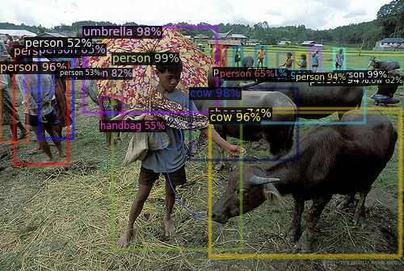
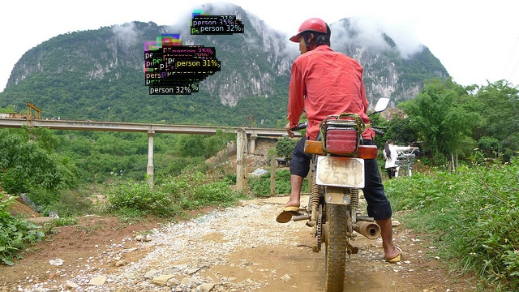
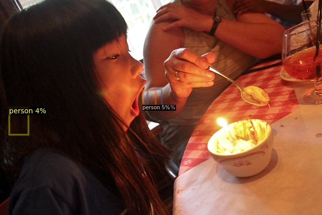
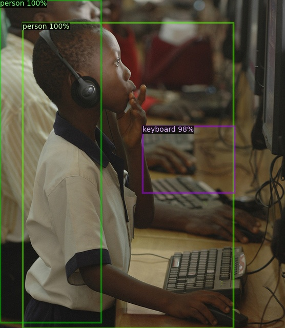
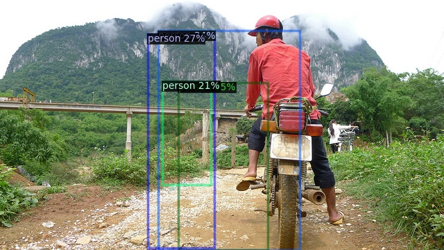
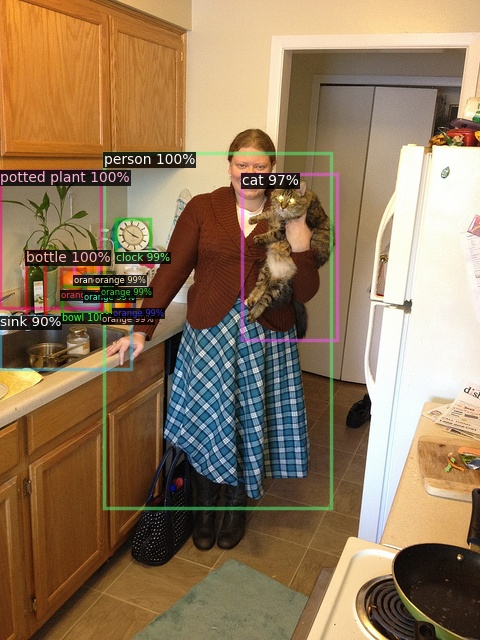

# Model Results
This directory contains all of the model results for each of the models that we trained. Each model includes visualizations 
of bounding box predictions for the 8 images contained in the small overfitting training dataset. There are also training loss 
graphs for each of the models.

## Built In Detectron2 Model

## Custom Bottom Up Backbone
### Full Dataset

## ResNet34 Backbone
### Full Dataset

### Small Dataset

## ResNet34 Backbone with Pretrained RPN and Fast RCNN Weights
### Small Dataset

## ResNet34 Backbone w/Pretrained Weights and Last Level Pooling Layer
### Full Dataset

### Small Dataset

